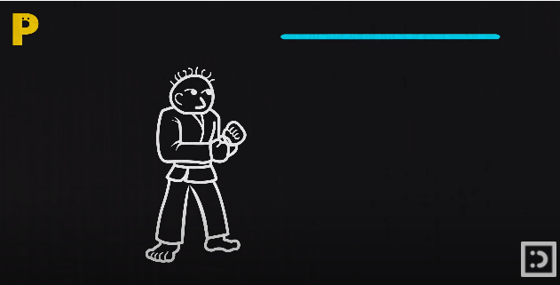
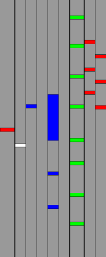
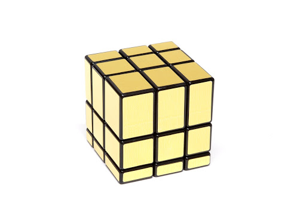
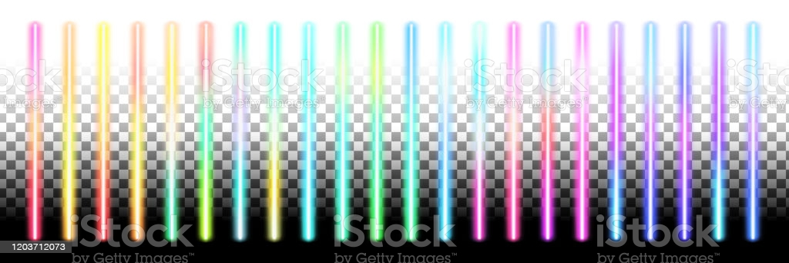
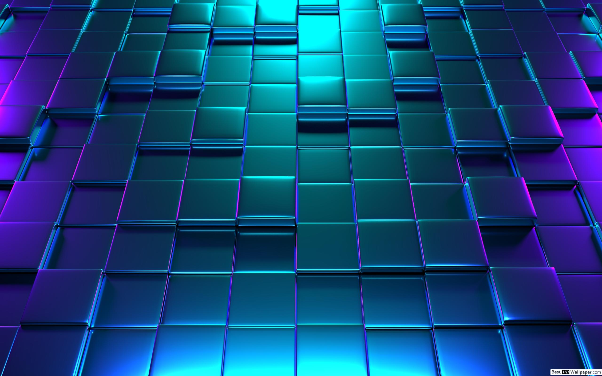

# 목차

[1.컨셉](#1-컨셉)  

[2. 관련 이미지와 동영상](#2-관련-이미지와-동영상)  

[3. 대표 이미지)](#3-대표-이미지) 

[4. 컨셉과 대표 이미지 기반 작품묘사](#4-컨셉과-대표-이미지-기반-작품묘사) 

[5. 게임 오브젝트 분해](#5-게임-오브젝트-분해)

[6. 파라미터(속성) 뽑아 보기](#6-파라미더-(속성)-뽑아-보기)

[7. 행동 뽑아보기](#7-행동-뽑아보기)

[8. 상태 뽑아보기](#8-상태-뽑아보기)

[9. 플레이어 캐릭터 속성(파라미터)](#9-플레이어-캐릭터-속성(파라미터))

[10. 게임의 규칙](#10-게임의-규칙)

[11. 게임에서 사용될 공식](#11-게임에서-사용될-공식)

   

# 1. 컨셉
## 메인컨셉 : Reaction
- 유저의 입력에 따라 역동적인 리액션을 보여주도록 하자.

### 서브 컨셉 1 : Rhythm
- 리듬게임에 기반하여 타이밍(노트)을 만들자.

### 서브 컨셉 2 : Simple
- 인터페이스, 입력키는 최대한 간단하게 만들어 접근성을 높히자.

### 서브 컨셉 3 : Score
- 점수시스템을 만들어서 경쟁심과 도전정신을 유도하자.

### 서브 컨셉 4 : Visual
- 유저에 입력에 반응하는 화려한 시각적 효과를 만들자.

### 서브 컨셉 5 : Taste
- 유저의 다양한 니즈에 맞추어 여러개의 노래풀을 만들자.

  

# 2. 관련 이미지 & 동영상
- 이미지  

- 동영상

  

# 3. 대표 이미지
  

  

# 4. 컨셉 & 대표이미지 기반 작품묘사
> ### 대표이미지 기반 :

> ### 컨셉 기반:

  

# [<게임제목> 구성 요소]

- 매커니즘, 이야기, 미적요소, 기술

 

## 1. 메커니즘

[도전 과제]
1) 리듬을 노트에 맞춰 오브젝트를 움직여보자
2) 미니멀리즘을 통해 첫시작에서 점점더 화려해지게 만들자

[재미 요소]
1) 박자에 맞게끔 버튼을 누르게 된다면 3개의 판정(dummy, good, super)이 존재 
2) 각 난이도를 조정해서 점점더 어려워지는 도전욕구 충족
3) 음악의 맞쳐 내려오는 노트를 맞춰 맵안의 오브젝트를 움직일수있음 
4) 간단한 조작감, 게임의 접근성을 높임
5) 시각적 화려함과 다른 리듬게임에서 볼수없었던 오브젝트의 역동적인 리액션을 즐길수있다 

 

## 2. 이야기

1) 스토리
없음(차후에 생각해보겠음)

[만들게 된 배경]  
리듬게임을 어떻게 더 역동적이면서도 단순하게 즐길 수 있을까에 대해서 고민하다 보니 지금처럼 아이디어가 나오게 되었습니다.

[카메라 관점]  
3인칭 시점으로 플레이어 뒤쪽 상단에 위치하여 맵을 움직이면서 전체적으로 볼 수 있게끔 고려

 

## 3. 미적요소

[디자인][컬러]  
1) 디자인 : 목표지점까지 도착할 수 있는 출발지와 도착지의 맵 요소 부분을 여러 타일 느낌으로 만들기
2) 리듬감을 맞춰 노트에 판정이 나올 시 화려한 연출, 효과로 인해 시각적 요소 부분의 몰입도 증가
3) 체력 시스템이 있어서 실수나 노트를 못 맞출 시 체력 없어지는 부분을 시각적 연출로 보여줄 것임

[음향]  
다양한 장르의 노래를 채용할 예정 

	
 

## 4. 기술  
유니티의 노트 관련된 UI 부분과 콤보와 라이프, 노트의 정확성을 알려주는 레벨 디자인, 노트 말고 다른 방식의 리듬감을 느낄 수 있게끔 표현하는 오브젝트의 역동적인 움직임을 표현

  

# 작품제목: Reaction
        
  

개발자: 김대경, 임광희

  

# 5. 게임 오브젝트 분해 (구성 요소분석)
	
|연번|오브젝트 이름|오브젝트 이미지|
|:---:|:---:|:---:|
|1|큐브||
|2|노트||
|3|루트||
|4|실버||
|5|골드||
|6|프리즘||
|7|피버노트||
|8|피버루트||
      

# 6. 파라미터(속성) 뽑아 보기
  

## 1) 오브젝트 이름: 큐브

|속성|속성값|설명|비고|
|:---:|:---:|:---:|:---:|
|이름|큐브|노트에 맞춰서 루트의 목표지점까지 이동||
|움직임|방향키|방향키로 움직일 수 있다.(노트에 맞춰서)||
|행동|결과|실패, 성공||
|상태|플레이어|움직임을 통해 플레이어가 컨드롤할 수 있다.
  

## 2) 오브젝트 이름: 노트

|속성|속성값|설명|비고|
|:---:|:---:|:---:|:---:|
|이름|노트|곡의 리듬에 맞게 좌측에서 우측으로 이동||
|움직임|방향키|왼쪽에서 오른쪽으로 이동하고 타이밍에 맞게버튼을 누른다||
|행동|결과|곡의 시작부터 끝까지 박자에 맞는 노트||
|상태|플레이어|Bad, normal, super의 판정이 존재
  

## 3) 오브젝트 이름: 루트

|속성|속성값|설명|비고|
|:---:|:---:|:---:|:---:|
|이름|루트|큐브가 지나갈 수 있는 맵||
|움직임|피버 노트|콤보가 일정수준을 도달 했을 때 ||
|행동|결과|출발지점부터 최종 목적지까지 연결||
|상태|맵|큐브가 갈 수 있는 지형
  

## 4) 오브젝트 이름: 실버

|속성|속성값|설명|비고|
|:---:|:---:|:---:|:---:|
|이름|실버|큐브의 새로운 스킨||
|움직임|큐브랑 동일|방향키로 움직일 수 있다.(노트에 맞춰서)||
|행동|결과|스킨 보상||
|상태|도전과제|콤보 100달성시 언락
  

## 5) 오브젝트 이름: 골드

|속성|속성값|설명|비고|
|:---:|:---:|:---:|:---:|
|이름|큐브|큐브의 새로운 스킨||
|움직임|큐브랑 동일|방향키로 움직일 수 있다.(노트에 맞춰서)||
|행동|결과|스킨 보상||
|상태|도전과제|콤보 150이상 달성시 언락
  
  
## 6) 오브젝트 이름: 프리즘

|속성|속성값|설명|비고|
|:---:|:---:|:---:|:---:|
|이름|큐브|큐브의 새로운 스킨||
|움직임|큐브랑 동일|방향키로 움직일 수 있다.(노트에 맞춰서)||
|행동|결과|스킨 보상||
|상태|도전과제|콤보 200이상 달성시 언락
  

## 7) 오브젝트 이름: 피버노트

|속성|속성값|설명|비고|
|:---:|:---:|:---:|:---:|
|이름|피버노트|콤보가 일정수준을 도달 했을 때 무지개 색 & 속도증가||
|움직임|방향키|기존 노트와 동일시 하지만 속도가 증가되었다||
|색상|빨,주,노,초,파,남,보|화려한 색상을 위해 무지개 색으로 변환||
|행동|결과|속도증가, 시각적 연출||
|상태|피버|콤보수 일정량 도달 (50콤보 이상)
  

## 8) 오브젝트 이름: 피버루트

|속성|속성값|설명|비고|
|:---:|:---:|:---:|:---:|
|이름|피버루트|콤보가 일정수준을 도달 했을 때 지형이 위, 아래로 높이가 달라지면서 큐브가 지나갈 수 있는 맵||
|움직임|위, 아래|기존 루트와 동일시 하지만 위, 아래로 높이가 움직인다.||
|행동|결과|위, 아래로 랜덤하게 움직임, 시각적 연출 ||
|상태|피버|콤보수 일정량 도달 (50콤보 이상)
      

# 7. 행동 뽑아보기
  

## 1) 오브젝트 이름: 큐브

|행동|설명|
|:---:|:---:|
|움직임|노트에 맞춰서 루트의 목표지점까지 이동|
  

## 2) 오브젝트 이름: 노트

|행동|설명|
|:---:|:---:|
|움직임|곡의 리듬에 맞게 좌측에서 우측으로 이동|
  

## 3) 오브젝트 이름: 루트

|행동|설명|
|:---:|:---:|
|움직임|큐브가 지나갈 수 있는 맵|
  

## 4) 오브젝트 이름: 실버

|행동|설명|
|:---:|:---:|
|큐브와 동일|큐브의 새로운 스킨|
  

## 5) 오브젝트 이름: 골드

|행동|설명|
|:---:|:---:|
|큐브와 동일|큐브의 새로운 스킨|
  

## 6) 오브젝트 이름: 프리즘

|행동|설명|
|:---:|:---:|
|큐브와 동일|큐브의 새로운 스킨|
  

## 7) 오브젝트 이름: 피버노트

|행동|설명|
|:---:|:---:|
|움직임|콤보가 일정수준을 도달 했을 때 무지개 색 & 속도증가|
  

## 8) 오브젝트 이름: 피버루트

|행동|설명|
|:---:|:---:|
|움직임|콤보가 일정수준을 도달 했을 때 지형이 위, 아래로 높이가 달라지면서 큐브가 지나갈 수 있는 맵|
      

# 8. 상태 뽑아보기
  

## 1) 오브젝트 이름: 큐브(실버, 골드, 프리즘과 동일)

|현상태|전이상태|전이조건|
|:---:|:---:|:---:|
|실패|다시하기|플레이어가 떨어졌을때|
|성공|다음스테이지|플레이어가 도착지점에 도착했을때|
  

## 2) 오브젝트 이름: 노트(피버노트와 동일)

|현상태|전이상태|전이조건|
|:---:|:---:|:---:|
|실패|하트|노트를 놓칠때 하트가 사라짐(총3개)|
|실패|dummy|노트를 놓칠때|
|성공|good|노트의 타이밍이 어중간할때|
|성공|super|노트의 정확한 타이밍|
|클리어|정지|플레이어가 도착지점에 도착했을때|
  

## 3) 오브젝트 이름: 루트(피버루트와 동일)

|현상태|전이상태|전이조건|
|:---:|:---:|:---:|
|움직임|멈춤|노트를 못맞출시 움직임 불가|
|멈춤|움직임|노트의 타이밍에 맞춰서 이동|
      

# 9. 플레이어 캐릭터 속성(파라미터)
   

|속성|속성값|설명|비고|
|:---:|:---:|:---:|:---:|
|체력|하트|체력은 3개이고 실패를 할시 생명력이 줄어든다||
|속도|움직임|기존속도와 피버속도가 다르다|콤보50이상시 피버 & 더빠른속도|
|스테이지 래밸|새로운 노래|점점 스테이지가 올라갈수록 어렵다||
      

# 10. 게임의 규칙 
  

## 1) 핵심의 규칙
시작점에서 최종목표지점까지 도착하는것이고
설령 도착하더라도 콤보라던지 노트의 정확성을 요구하여 점수를 높게 받는것이 목표입니다

## 2) 보조규칙
총 3번의 기회(하트)가 있으며 노트의 타이밍을 못 맞추거나 놓치게 되면 'dummy'이란 판정이 나와서 하트가 없어집니다 또한 플레이어를 움직이면서 루트에서 떨어질 시 하트가 없어집니다. 하트가 1개씩 없어질 때마다   콤보 또한 리셋됩니다.
      

# 11. 게임에서 사용될 공식
게임에서 어떤 이벤트가 발생했을 때,   그 결과를 판단하기 위한 계산 공식을 지정
    

### 1)기존상태와 50콤보 이상시 피버 효과 전환
### 2)게임이 실패가 되면 다시하기조건 적용
### 3)노트 판정부분 3개의 판정(dummy, good, super) 타이밍 조절
### 4)스킨보상(실버, 골드, 프리즘)도전과제 적용
### 5)목표지점까지 성공했을 때 다음 스테이지 전환
  
