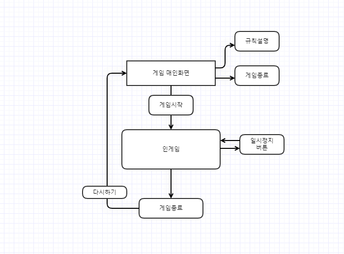
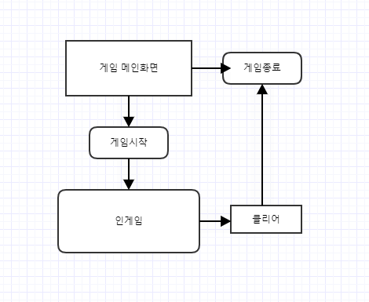
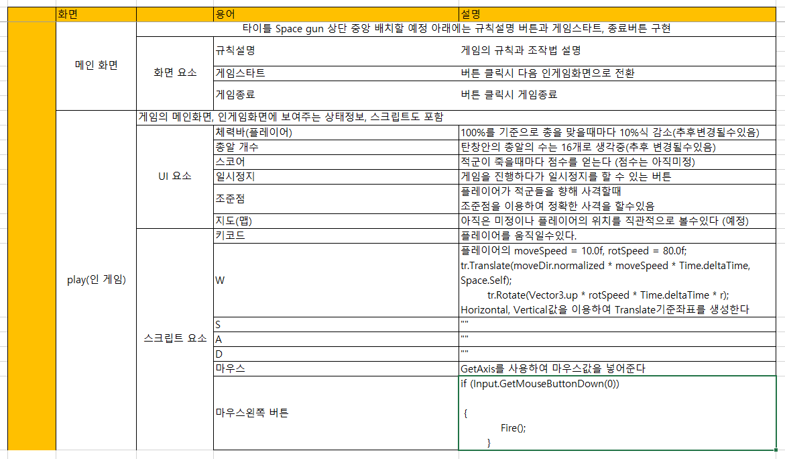
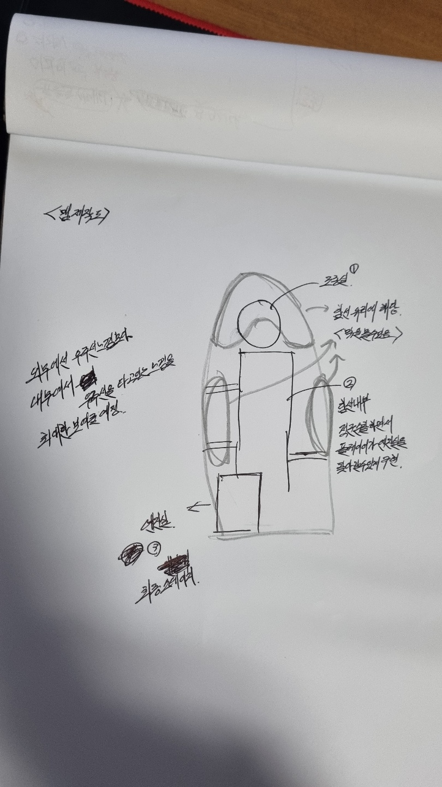
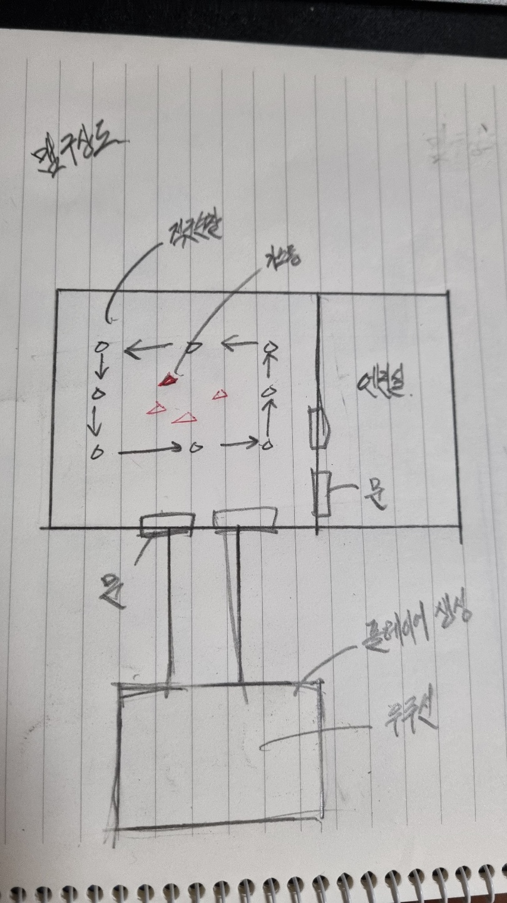

# 목차
# 게임명: Space gun(스페이스 건)
 

[1. 컨셉](#1-컨셉)  

[2. 관련 이미지와 동영상](#2-관련-이미지와-동영상)  

[3. 대표 이미지](#3-대표-이미지) 

[4. 컨셉과 대표 이미지 기반 작품묘사](#4-컨셉과-대표-이미지-기반-작품묘사) 

[5. 게임 오브젝트 분해](#5-게임-오브젝트-분해)

[6. 파라미터 뽑아보기](#6-파라미더-뽑아보기)

[7. 행동 뽑아보기](#7-행동-뽑아보기)

[8. 상태 뽑아보기](#8-상태-뽑아보기)

[9. 플레이어 캐릭터 속성(파라미터)](#9-플레이어-캐릭터-속성(파라미터))

[10. 게임의 규칙](#10-게임의-규칙)

[11. 게임에서 사용될 공식](#11-게임에서-사용될-공식)

[12. 개발 요구사항과 흐름도](#12-개발-요구사항과-흐름도)

[13. 시간별 흐름도](#13-시간별-흐름도)

[14. 키보드 이벤트에 대한 흐름도](#14-키보드-이벤트에-대한-흐름도)

[15. 용어정리](#15-용어정리)

[16. 주별 개발작업 & 작업결과 목록](#16-주별-개발작업-&-작업결과-목록)

[17. 맵 구상도](#17-맵-구상도)
   

# 1. 컨셉
## 메인컨셉 : Space
- 게임 전체의 분위기는 우주이고 유저들에게 웅장하고 신비한 분위기를 주는 것이 목표
### 서브 컨셉 1 : Future
- 미래지향적이고 세계관 콘셉트는 디스토피아 느낌을 줄 것

### 서브 컨셉 2 : Simple
- 인터페이스, 입력키는 최대한 간단하게 만들어 접근성을 높히자.

### 서브 컨셉 3 : Enemy
- 적군들이 플레이어와 상호작용 공격 & 회피 할 수 있게끔 제작.

### 서브 컨셉 4 : Action
- 3인칭 FPS장르라서 1인칭보다 보여줄 수 있는 효과, 시점면에서는 다양하게 보여줄 것이라고 생각됨

### 서브 컨셉 5 : Sound
- 걸을 때마다의 발걸음 소리라든지 피격을 등 음향효과를 신경 써서 좀 더 몰입감을 주도록 신경 쓸 것

  

# 2. 관련 이미지와 동영상
- 이미지  

- 동영상

  

# 3. 대표 이미지
  

  

# 4.컨셉과 대표 이미지 기반 작품묘사
> ### 대표이미지 기반 : 우주 배경의 FPS를 구연할 것입니다.

> ### 컨셉 기반: 1인칭 FPS

  

# [ Space gun(스페이스 건) 구성 요소 ]

- 매커니즘, 이야기, 미적요소, 기술

 

## 1. 메커니즘

[도전 과제]
1) 1인칭 시점으로 적군과 상호작용
2) 플레이어의 에니메이션을 주어 역동적이게 보이기

[재미 요소]
1) 상호작용에 따른 효과음
2) 적군의 난이도는 조금 하드하게 맞춰 도전 욕구 충족
3) 에니메이션과 파티클의 효과로 비주얼측면에서 좀더 많은 관심과 몰입감
4) 친숙한 조작감, 처음 게임을 접해도 누구든 할수있게끔 접근성을 높임

 

## 2. 이야기

1) 스토리
인류가 우주까지 진출하면서 많은 행성들을 식민지화하지만 자원에 비해 인류는 점점 더 많이 증가하게 되고 자원전쟁이 발발하게 된다 어떻게든 살고자 약탈과 전쟁이 지속적이게 이뤄지고 그사이에서 우주해적이 생겨나게 된다. 제국에선 우주해적이 제국까지 피해를 줄 정도로 급속도로 성장하자 우주 보안관을 임명하여 우주해적들과의 전쟁을 선포한다. 인류를 구원할 에너지자원을 담은 함선의 캡틴이 여러분들이 플레이할 주인공이다. 호시탐탐 주인공의 함선을 노리고 있는 우주해적들은 함선엔진 쪽에 침입하여 엔진을 정지시키고 자원을 약탈할 준비를 한다. 과연 주인공은 이 위기를 어떻게 헤쳐 나갈 것인가?
 

[만들게 된 배경]  
원래는 유니티 네트워크를 이용하여 2명에서 협동하는 퍼즐게임을 제작하려고 했지만 게임을 구연하는 건 힘들 것 같아서 그래도 많이 배웠고 공부했던 FPS 장르로 바꾸게 되었습니다.
 

[카메라 관점]  
3인칭 시점 

 

## 3. 미적요소

[디자인][컬러]  
1) 디자인 : 우주 배경 맵같은경우는 함선내부로 생각하고있음 (외부로 보이는 우주배경도 보이게 할예정)
2) 파티클을 사용하여 플레이어 & 적군들이 피격을 받는 효과연출
3) UI부분에서 사격표시, 플레이어의 총알갯수, 체력표시를 할예정

[음향]  
배경음악보다도 각 총이 발사되는 소리라든지 발걸음, 세밀한 부분의 사운드를 좀 더 신경 쓸 예정

	
 

## 4. 컨셉과 대표 이미지 기반 작품묘사
디스토피아 세계관에서 플레이어가 적군들을 최대한 많이 제거하면서 무쌍한다는 즐거움을 주는 것이 목표와 더불어 단순히 적군만 제압하는 게임이 아니라 목적(EX: 우주 함선을 움직일 수 있게 엔진을 고친다.) 목표로 게임이 진행되는 스토리성 조건 만들고 엔진을 수리해야만 게임 엔딩될 수 있도록 제작할 것입니다.

  

# 작품제목: Space gun
        
  

개발자: 임광희(총괄)

  

# 5. 게임 오브젝트 분해
	
|연번|오브젝트 이름|오브젝트 이미지|
|:---:|:---:|:---:|
|1|플레이어||
|2|적군||
|3|총알||
|4|맵||
      
   

# 6. 파라미터 뽑아보기
 

## 1) 오브젝트 이름: 플레이어

|속성|속성값|설명|비고|
|:---:|:---:|:---:|:---:|
|이름|플레이어|유저들의 조작으로 게임을 플레이할수있다||
|움직임|WASD, 마우스|WASD키로 움직일수있고 마우스로 플레이어의 시점과 총을 발사를 할수있다.||
|행동|결과|플레이어의 행동(움직임, 총알발사)을 취할수있다||
|상태|플레이어|움직임을 통해 플레이어가 컨드롤할 수 있다.
  
  

## 2) 오브젝트 이름: 적군

|속성|속성값|설명|비고|
|:---:|:---:|:---:|:---:|
|이름|적군|플레이어를 따라가고 공격한다|회피기능은 일단 추후에 생각|
|움직임|AI|플레이어를 보면 총알을 발사 & 따라감|회피는 플레이어가 총알을 격발했을때 회피|
|행동|결과|플레이어를 따라가면서 공격||
|상태|적군|플레이어 공격 & 회피
  
  

## 3) 오브젝트 이름: 총 & 총알

|속성|속성값|설명|비고|
|:---:|:---:|:---:|:---:|
|이름|총알|플레이어가 들고있는 총에서 발사||
|움직임|마우스 왼쪽키|왼쪽키를 누를때마다 발사|총의 총알갯수는 아직 미정|
|행동|결과|적을 제거할수있고 벽에 총알이 박혔을때 시간이 지나면 사라짐||
|상태|총알| 적, 플레이어, 벽의 충돌상호작용
  
  

## 4) 오브젝트 이름: 맵(벽이나 바닥)

|속성|속성값|설명|비고|
|:---:|:---:|:---:|:---:|
|이름|맵|바닥같은경우 플레이어의 지형,벽은 플레이어가 벽을 항해 총을 발사할시 총알이 벽에 남아있다 시간이 지나면 사라짐||
|움직임|없음|움직일 수 있다.||
|행동|없음|없음||
|상태|벽|충돌체

   

# 7. 행동 뽑아보기
  
 

## 1) 오브젝트 이름: 플레이어

|행동|설명|
|:---:|:---:|
|움직임|WASD를 이용하여 플레이어가 원하는 움직임을 구사|

  

## 2) 오브젝트 이름: 적군

|행동|설명|
|:---:|:---:|
|움직임|AI 플레이어쪽으로 따라감|
  
 

## 3) 오브젝트 이름: 총 & 총알

|행동|설명|
|:---:|:---:|
|움직임|총구의 방향으로 직선으로 빠르게 이동|
  
  

## 4) 오브젝트 이름: 맵

|행동|설명|
|:---:|:---:|
|없음|플레이어가 밟을수있는 바닥,벽등 지형지물|

   

# 8. 상태 뽑아보기
  
   

## 1) 오브젝트 이름: 플레이어

|현상태|전이상태|전이조건|
|:---:|:---:|:---:|
|피격|체력감소|적군에게 총알을 맞았을때, 마우스왼쪽 클릭 |
|노피격|체력변화없음|적군에게 총알이 빗맞거나 아무런 상태가 없을때,  마우스왼쪽 클릭을 누르지않을때|
|움직임|어떤 방항으로 플레이어가 이동|WASD|
|움직임없음|제자리에 있음|아무런 키를 누르지 않았을때|

     

## 2) 오브젝트 이름: 적군

|현상태|전이상태|전이조건|
|:---:|:---:|:---:|
|피격|체력감소|플레이어에게 총알을 맞았을때|
|노피격|체력변화없음|플레이어가 총알이 빗맞거나 아무런 상태가 없을때|
|움직임|플레이어가 있는 방향으로 움직임|AI|
   

## 3) 오브젝트 이름: 총알

|현상태|전이상태|전이조건|
|:---:|:---:|:---:|
|발사|움직임(직선)|왼쪽마우스 클릭|
|무반응|움직임없음|왼쪽마우스 클릭을 누르지않았을때|

  

## 3) 오브젝트 이름: 맵

|현상태|전이상태|전이조건|
|:---:|:---:|:---:|
|바닥|없음|움직임 불가|
|벽|총알이 벽에 맞았을때|시간이 지나면 총알이 박힌게 사라짐|
      
   

# 9. 플레이어 캐릭터 속성(파라미터)
   

|속성|속성값|설명|비고|
|:---:|:---:|:---:|:---:|
|체력|체력바|총알에 피격될때마다 감소||
|속도|움직임|각WASD방향으로 움직임||
      
   

# 10. 게임의 규칙
  

## 1) 핵심의 규칙
최대한 많은 적군들을 죽여서 높은점수를 얻는것이 목표

     

# 11. 게임에서 사용될 공식
  

### 1) 적군의 AI관련 기능(플레이어를 따라가게끔 만들기)
  

### 2) 카메라가 플레이어 뒤쪽 윗방향으로 마우스커서를 따라감
  

### 3) 각 상호작용에 맞는 사운드효과 
  

### 4) 적군의 회피기능(이부분은 좀더 고민하고 넣을 예정)
  

### 5) 피격 당했을때 체력감소 & 적군 체력기능 
   

# 12. 개발 요구사항과 흐름도
# <Space gun 개발 요구사항>
  

### 1) 추가적인 기능이나 아이디어가 생길시 게임에 먼저 적용한뒤 깃허브를 주기적으로 수정

### 2) 총에 맞았을시 피격모션

### 3) 맵 제작에 있어 항공 우주 함선에 있다는 분위기를 심어줘야 함

### 4) 총의 세밀한 부분 탄피 떨어지는 모션

### 5) 배경음악보단 각 상호작용했을 때 나는 효과음에 좀 더 신경 쓸 것

### 6) 총이 격발되었을 때 퍼지는 빛 파티클 효과

### 7) 적군의 AI 상태 변환 조건을 고려하여 제작하기

### 8) 플레이어랑 적군이 일정 거리만큼 멀어질수록 적군이 시아에서 들어오지 않게끔 구현

### 9) 게임을 플레이하면서 스토리성 조건(엔진 수리) 만들고 플레이를 하면서 스토리에 몰입할 수 있도록 구현
   

# 13. 시간별 흐름도
 

## 개발하면서 순서도 또한 수정하였습니다.

  

# 14. 키보드 이벤트에 대한 흐름도
 

  

# 15. 용어정리
 

  

# 16. 주별 개발작업 & 작업결과 목록
 

## 1~2주차: 깃허브 블로그(컨셉, 순서도, 개발로직)작성, 간단한 게임내부 기초틀 구상
 

## 3~4주차: 총구에서 총알 발사 & 벽에 박혀있다 시간 지나면 사라짐, 적군생성, AI, 애니메이션 개발
 

## 5~6주차: 적군의 AI(순찰루트, 적군이 플레이어를 바라봤을때 인식하고 공격, 순찰을 돌면서 플레이어 감지)
 

## 7~8주차: 맵 제작, 오브젝트 충돌, 카메라 시점보완(FPS -> TPS), 메인UI제작
 

## 9~10주차: 카메라 시점 오류나는것 수정, 메인UI 완료 
 

## 11~12주차: 다시 우주선으로 돌아왔을 때 게임종료, 플레이어 생성되는 위치 수정, 코드 수정
 

## 13주차: 에러나거나 플레이를 했을 때 진행이 안되는점 수정

  

# 17. 맵 구상도
 

### 위에 있는 에셋을 이용하여 맵을 구상하면서 제작할 것입니다.

  
