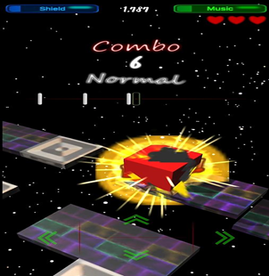
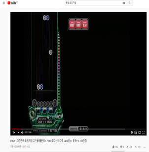
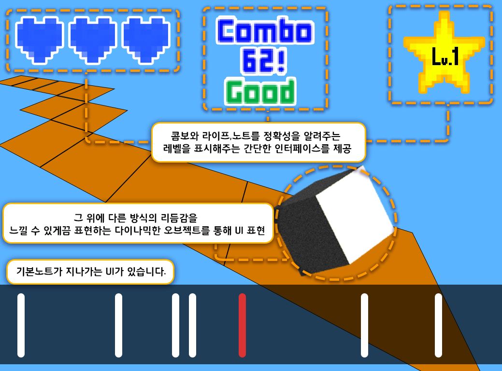

# [컨셉]
## 메인컨셉 : Reaction
- 유저의 입력에 따라 역동적인 리액션을 보여주도록 하자.

### 서브 컨세 1 : Rhythm
- 리듬게임에 기반하여 타이밍(노트)을 만들자.

### 서브 컨세 2 : Simple
- 인터페이스, 입력키는 최대한 간단하게 만들어 접근성을 높히자.

### 서브 컨세 3 : Score
- 점수시스템을 만들어서 경쟁심과 도전정신을 유도하자.

### 서브 컨세 4 : Visual
- 유저의 입력에 반응하는 화려한 시각적 효과를 만들자.

### 서브 컨세 5 : Taste
- 유저의 다양한 니즈에 맞추어 여러개의 노래풀을 만들자.

  
# [관련 이미지 & 동영상]
- 이미지  

- 동영상

  
# [대표 이미지]

  
# [컨셉 & 대표이미지 기반 작품묘사]
> ### 대표이미지 기반 :

> ### 컨셉 기반:

  
# [<Reaction> 구성 요소]

- 매커니즘, 이야기, 미적요소, 기술

 

## 1. 메커니즘
# 리액션, 역동적
[도전 과제]
1) 리듬을 노트에 맞춰 오브젝트를 움직여보자
2) 미니멀리즘을 통해 첫시작에서 점점더 화려해지게 만들자

[재미 요소]
1) 박자에 맞게끔 버튼을 누르게 된다면 3개의 판정(dummy, good, super)이 존재 
2) 각 난이도를 조정해서 점점더 어려워지는 도전욕구 충족
3) 음악의 맞쳐 내려오는 노트를 맞춰 맵안의 오브젝트를 움직일수있음 
4) 간단한 조작감, 게임의 접근성을 높임
5) 시각적 화려함과 다른 리듬게임에서 볼수없었던 오브젝트의 역동적인 리액션을 즐길수있다 

 

## 2. 이야기

1) 스토리
없음(차후에 생각해보겠음)

[만들게 된 배경]  
리듬게임을 어떻게 더 역동적이면서도 단순하게 즐길 수 있을까에 대해서 고민하다 보니 지금처럼 아이디어가 나오게 되었습니다.

[카메라 관점]  
3인칭 시점으로 플레이어 뒤쪽 상단에 위치하여 맵을 움직이면서 전체적으로 볼 수 있게끔 고려

 

## 3. 미적요소

[디자인][컬러]  
1) 디자인 : 목표지점까지 도착할 수 있는 출발지와 도착지의 맵 요소 부분을 여러 타일 느낌으로 만들기
2) 리듬감을 맞춰 노트에 판정이 나올 시 화려한 연출, 효과로 인해 시각적 요소 부분의 몰입도 증가
3) 체력 시스템이 있어서 실수나 노트를 못 맞출 시 체력 없어지는 부분을 시각적 연출로 보여줄 것임

[음향]  
다양한 장르의 노래를 채용할 예정 
	
 

## 4. 기술  
유니티의 노트 관련된 UI 부분과 콤보와 라이프, 노트의 정확성을 알려주는 레벨 디자인, 노트 말고 다른 방식의 리듬감을 느낄 수 있게끔 표현하는 오브젝트의 역동적인 움직임을 표현
